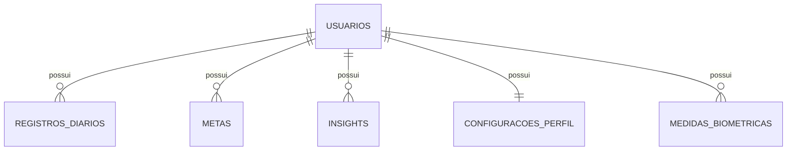

# Documentação Técnica: Ritmo

## 1. Visão geral

O Ritmo é um sistema web de análise pessoal que combina registro diário, biometria e metas para ajudar o usuário a acompanhar padrões de comportamento e saúde.

O projeto é dividido em:

- **backend** em ASP.NET Core Web API
- **frontend** em React + Vite
- **banco relacional** PostgreSQL

O foco atual do produto está em:

- registro de hábitos
- acompanhamento biométrico
- metas de rotina e peso
- visualização analítica no dashboard

## 2. Estado real do projeto

### 2.1. O que está implementado

- cadastro e login
- autenticação JWT
- hash de senha no backend
- CRUD de registros diários
- CRUD de metas
- CRUD de biometria
- leitura de insights
- dashboard com gráficos e cards
- exportação de dados

### 2.2. O que ainda não está completo

- motor maduro de geração automática de insights
- refresh token
- testes automatizados
- observabilidade e métricas operacionais
- pipeline de deploy

### 2.3. Por que isso importa

**Fato**

A documentação antiga tratava alguns pontos como se já estivessem totalmente consolidados, principalmente insights automáticos.

**Inferência**

O código atual mostra um MVP funcional com boas bases, mas ainda em evolução.

**Opinião técnica**

Documentar o estado real é importante para evitar expectativa errada, reduzir retrabalho e apoiar decisões técnicas mais honestas.

## 3. Arquitetura

## 3.1. Backend

O backend segue uma arquitetura simples e direta:

- `Controllers` expõem a API REST
- `Services` concentram parte da regra de negócio
- `AppDbContext` faz o acesso ao PostgreSQL via EF Core

### Principais arquivos

- [Program.cs](/c:/Users/felip/OneDrive/git_work/RitmoApi/Ritmo.Api/Program.cs)
- [AppDbContext.cs](/c:/Users/felip/OneDrive/git_work/RitmoApi/Ritmo.Api/Data/AppDbContext.cs)
- [UsuarioService.cs](/c:/Users/felip/OneDrive/git_work/RitmoApi/Ritmo.Api/Services/UsuarioService.cs)
- [RegistroDiarioService.cs](/c:/Users/felip/OneDrive/git_work/RitmoApi/Ritmo.Api/Services/RegistroDiarioService.cs)
- [BiometriaService.cs](/c:/Users/felip/OneDrive/git_work/RitmoApi/Ritmo.Api/Services/BiometriaService.cs)
- [MetaService.cs](/c:/Users/felip/OneDrive/git_work/RitmoApi/Ritmo.Api/Services/MetaService.cs)

## 3.2. Frontend

O frontend é uma SPA React com duas áreas centrais:

- autenticação
- dashboard

### Principais arquivos

- [App.jsx](/c:/Users/felip/OneDrive/git_work/RitmoApi/frontend/src/App.jsx)
- [Login.jsx](/c:/Users/felip/OneDrive/git_work/RitmoApi/frontend/src/pages/Login.jsx)
- [Dashboard.jsx](/c:/Users/felip/OneDrive/git_work/RitmoApi/frontend/src/pages/Dashboard.jsx)
- [useDashboardData.js](/c:/Users/felip/OneDrive/git_work/RitmoApi/frontend/src/hooks/useDashboardData.js)
- [apiClient.js](/c:/Users/felip/OneDrive/git_work/RitmoApi/frontend/src/api/apiClient.js)

## 4. Fluxo principal do sistema

### 4.1. Autenticação

1. Usuário faz cadastro ou login.
2. O backend retorna `token`, `expiresAt` e `usuario`.
3. O frontend salva a sessão localmente.
4. O Axios envia automaticamente `Authorization: Bearer ...`.

### 4.2. Dashboard

Depois do login, o frontend carrega em paralelo:

- usuário
- registros diários
- configuração de perfil
- insights
- metas
- biometria

Esse carregamento é feito em [useDashboardData.js](/c:/Users/felip/OneDrive/git_work/RitmoApi/frontend/src/hooks/useDashboardData.js).

### 4.3. Registro diário

O registro diário representa hábitos do dia. O backend aplica lógica de atualização por data, evitando duplicidade quando o mesmo usuário salva novamente o mesmo dia.

### 4.4. Biometria

A biometria é tratada separadamente do registro diário.

Cada entrada contém:

- peso
- altura
- data

Regras importantes:

- o backend consolida biometria por dia
- se o usuário registrar novamente no mesmo dia, o valor do dia é atualizado
- o histórico do dashboard usa um registro consolidado por data

### 4.5. Metas

As metas são ligadas ao usuário e usadas no dashboard para comparar alvo versus situação atual.

Categorias suportadas:

- `Sono`
- `Agua`
- `Humor`
- `Produtividade`
- `Energia`
- `Treino`
- `Peso`

## 5. Modelo de dados



## 5.1. Usuario

- `Id`
- `Nome`
- `Email`
- `Senha`
- `DataCriacao`
- `DataNascimento`
- `Sexo`

## 5.2. RegistroDiario

- `Id`
- `UsuarioId`
- `Data`
- `Humor`
- `Sono`
- `Produtividade`
- `Energia`
- `Exercicio`
- `Agua`
- `Observacoes`
- `DataCriacao`

## 5.3. MedidaBiometrica

- `Id`
- `UsuarioId`
- `Peso`
- `Altura`
- `Data`

### Observação

O IMC não é persistido como coluna principal de negócio. Ele é calculado na API e entregue ao frontend via DTO de resposta.

## 5.4. Meta

- `Id`
- `UsuarioId`
- `Categoria`
- `ValorAlvo`
- `Descricao`
- `DataInicio`
- `DataFim`
- `Ativa`
- `DataCriacao`

## 5.5. Insight

- `Id`
- `UsuarioId`
- `Mensagem`
- `Categoria`
- `Nivel`
- `DataGeracao`
- `Lido`

## 5.6. ConfiguracaoPerfil

- `Id`
- `UsuarioId`
- `TemaEscuro`
- `Idioma`
- `FusoHorario`
- `ReceberNotificacoes`
- `ReceberRelatorioSemanal`
- `ExibirMetaNoDashboard`

## 6. Segurança implementada

## 6.1. Senhas

**Fato**

O projeto deixou de salvar senha em texto puro e passou a usar hash no backend.

**Impacto**

- reduz risco de vazamento direto
- melhora o padrão mínimo de segurança
- prepara o sistema para autenticação real

## 6.2. JWT

O backend usa JWT Bearer para autenticação.

Isso significa que:

- o login gera token assinado
- endpoints protegidos exigem autenticação
- controllers validam o dono do recurso

## 6.3. CORS

O CORS foi deixado configurável por origem, usando `Cors:AllowedOrigins`.

Isso é importante porque:

- evita abertura total da API
- permite diferenciar `localhost` e `127.0.0.1`

## 6.4. Configuração local

O projeto suporta `appsettings.Local.json`, ignorado no Git, para guardar:

- connection string local
- configurações JWT
- origens de CORS

Também existe uma factory para `dotnet ef`, em [AppDbContextFactory.cs](/c:/Users/felip/OneDrive/git_work/RitmoApi/Ritmo.Api/Data/AppDbContextFactory.cs), permitindo migrations e comandos de banco fora da inicialização completa da API.

## 7. Validação e regras de domínio

## 7.1. Validação estrutural

O backend usa `DataAnnotations` para validar:

- obrigatoriedade
- formatos
- faixas básicas
- limites de tamanho

Quando o payload é inválido, a API responde com:

- `mensagem`
- `erros` por campo

## 7.2. Validação semântica

Além do formato, existem regras de negócio aplicadas nos serviços.

Exemplos:

- data de nascimento não pode ser futura
- biometria não pode ser anterior ao nascimento
- registro diário não pode ser futuro
- `DataFim` da meta não pode ser anterior a `DataInicio`
- cada categoria de meta possui sua própria faixa válida

## 7.3. Ajuste importante em metas decimais

Foi corrigido um bug sutil no cadastro de metas.

**Fato**

O uso de `Range(typeof(decimal), "0.1", "100")` causava erro dependendo da cultura do ambiente, especialmente em contexto `pt-BR`.

**Correção**

A validação de `ValorAlvo` passou a ser feita com `IValidatableObject`, usando `decimal` real no código.

**Impacto prático**

- elimina erro interno ao salvar meta
- reduz dependência da cultura do servidor
- deixa a validação mais previsível

## 8. Regras específicas de metas

## 8.1. Metas de hábito

Para `Sono`, `Agua`, `Humor`, `Produtividade` e `Energia`, o dashboard calcula uma média recente e compara com o alvo.

## 8.2. Meta de treino

Para `Treino`, o sistema conta dias da semana com exercício marcado.

## 8.3. Meta de peso

Meta de peso não pode usar a lógica simples de “quanto maior, melhor”.

Por isso, a regra implementada é:

- calcula o peso inicial de referência desde o início da meta
- calcula a distância entre o peso atual e o alvo
- mede o quanto essa distância diminuiu

Essa abordagem é melhor porque funciona para:

- emagrecimento
- ganho de peso
- manutenção próxima ao alvo

No dashboard:

- o card mostra `Peso atual`
- o percentual mede aproximação do alvo
- a situação visual muda conforme a proximidade

## 9. Gráficos e dashboard

## 9.1. Panorama

O panorama mostra cards e gráficos de visão geral.

## 9.2. Análise

A aba de análise mostra gráficos mais detalhados, incluindo evolução de peso.

Melhorias recentes:

- datas do eixo com ano
- tooltip com data completa
- correções para evitar falha visual ao passar o mouse

## 9.3. Relatórios

O dashboard permite exportar:

- CSV
- Excel

## 10. Ambiente local

## 10.1. Backend

```powershell
dotnet run --project Ritmo.Api
```

Swagger:

```text
http://localhost:5066/swagger
```

## 10.2. Frontend

```powershell
cd frontend
npm install
npm run dev
```

Frontend:

```text
http://localhost:5173
```

## 10.3. Banco

```powershell
dotnet ef database update --project Ritmo.Api
```

## 11. Limitações atuais

### Técnicas

- não há suíte de testes automatizados
- não há CI/CD
- ainda faltam logs e métricas operacionais
- o frontend ainda usa `alert` em alguns fluxos

### Produto

- o módulo de insights ainda não representa um motor analítico completo
- não há gestão avançada de sessão, como refresh token e revogação

## 12. Próximos passos recomendados

### Curto prazo

- melhorar mensagens de erro no frontend
- adicionar testes para services
- reduzir acoplamento do `Dashboard.jsx`

### Médio prazo

- criar geração automática real de insights
- adicionar refresh token
- preparar pipeline de validação e deploy

### Longo prazo

- observabilidade
- auditoria de segurança mais profunda
- endurecimento para produção
