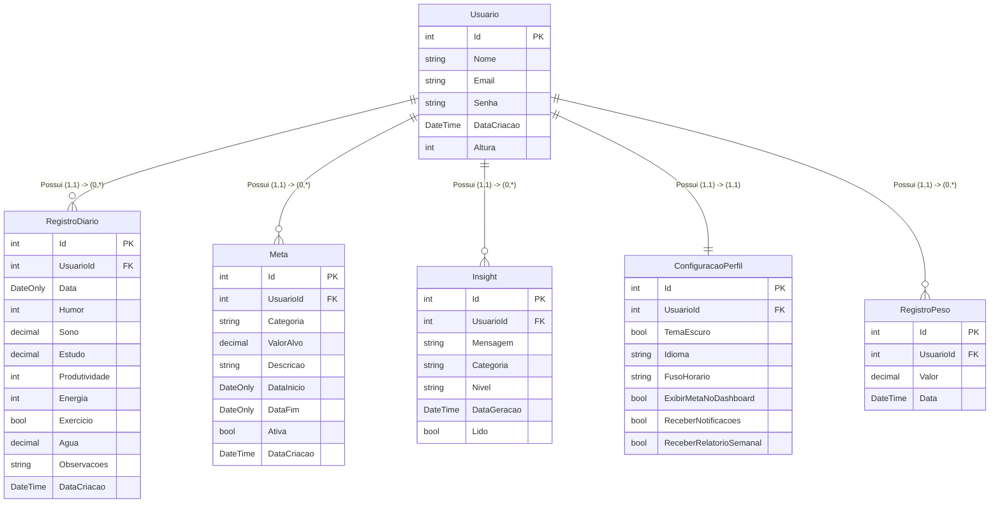

# Documentação Completa: Ritmo, Personal Analytics Dashboard

## 1. Visão Geral do Projeto

### 1.1. O que é o Ritmo?
O Ritmo é um sistema web (Dashboard de Vida Pessoal) focado em permitir que os usuários registrem dados cotidianos, como humor, horas de sono, foco, energia e consumo de água, para depois transformar essas informações em visualizações úteis e insights inteligentes sobre suas rotinas. O foco não reside apenas em ser um repositório de dados, mas sim em uma ferramenta ativa de análise comportamental direcionada à geração de valor.

### 1.2. Objetivo Central
O propósito do projeto é ajudar o usuário a extrair padrões de sua própria vida, respondendo a perguntas práticas:
* Quando sou mais produtivo?
* Uma boa noite de sono reflete de forma tangível no meu humor?
* Quais os melhores dias da semana para o estudo?

### 1.3. O Diferencial
Ao contrário de ferramentas tradicionais de rastreamento de hábitos, o Ritmo não se limita a mostrar o que foi preenchido. Ele conta com um forte pilar de geração automática de insights e comparações entre as semanas. O projeto foi desenhado sob a perspectiva de um produto real, interligando engenharia de software com noções claras de Business Intelligence e análise de dados.

## 2. Visão Arquitetural

O desenvolvimento foi construído sobre uma base robusta, dividida em três pilares clássicos de aplicações modernas:

1. **Frontend**: Desenvolvido em React puro com uso de hooks, desenhado para apresentar gráficos com bibliotecas como Recharts ou Chart.js, estruturado através de uma interface de usuário minimalista baseada em cartões (cards).
2. **Backend**: Sustentado em .NET 8 no modelo Web API, responsável por prover uma interface RESTful robusta e performática.
3. **Banco de Dados**: PostgreSQL, escolhido pela sua solidez, natureza de código aberto e suporte confiável a variados tipos de dados e grandes tabelas relacionais.

## 3. A Teoria de Tudo: Fundamentos e Conceitos Chaves

Para que a implementação faça completo sentido estatístico e arquitetural, é primordial compreendermos a base teórica de cada tecnologia escolhida.

### 3.1. Arquitetura REST e o Protocolo HTTP
A interligação entre o frontend e o backend é realizada através de uma **API REST** (Representational State Transfer). Uma API funciona como um contrato de comunicação. A arquitetura REST dita regras cruciais:
* **Protocolo Base**: A comunicação ocorre completamente sobre o protocolo HTTP.
* **Recursos via URLs**: Todo elemento manipulável, como usuários e metas, é identificado unicamente por uma rota.
* **Verbos Semânticos**: As operações expressam a intenção da chamada através dos métodos do HTTP:
  * `GET`: Leitura ou busca de dados.
  * `POST`: Criação de um novo recurso a partir da carga de dados enviada.
  * `PUT`: Substituição completa de uma informação.
  * `PATCH`: Atualização parcial, aplicando uma alteração específica em um atributo.
  * `DELETE`: Remoção permanente ou lógica de um registro.

Além disso, a API REST foi concebida para ser sem estado (stateless). Isso significa que cada requisição deve conter todas as informações necessárias para que o servidor consiga interpretá-la e executá-la com sucesso, dispensando memória de longo prazo sobre o cliente na camada lógica. O retorno sempre é acompanhado de um código de resposta HTTP padrão. Os indicativos clássicos são o código 200 (OK para o sucesso), o 404 (Not Found para dados não encontrados) ou o 500 (Erro interno do servidor).

### 3.2. C# e o Ecossistema .NET 8
O C# é a linguagem base, fortemente tipada e orientada a objetos. O ambiente de execução escolhido, .NET 8 em sua versão Long Term Support, agrupa as ferramentas fundamentais de execução. No .NET moderno, o arquivo principal de entrada (`Program.cs`) inicia um bloco de construção onde os serviços são configurados primeiro para, em seguida, determinar a sequência de operações da rota (o famoso pipeline HTTP). O uso de Controllers permite criar classes dedicadas a ouvir chamadas externas, validá-las e tratá-las de modo organizado.

### 3.3. Injeção de Dependência (DI)
Uma premissa adotada no software foi não acoplar a construção dos objetos. Ao invés do código principal construir o banco de dados manualmente, nós delegamos isso ao contêiner de Injeção de Dependências.
Mas o que é isso? Formalmente, um módulo não deve criar os objetos dos quais depende. Se um controller focado nos usuários precisa salvar no PostgreSQL, ele pede o acesso através do seu construtor, recebendo o objeto já preparado pelo painel de controle do framework. Isso gera um código coeso, fácil de testar individualmente e propício para manutenção orgânica.

### 3.4. O Poder do Assincronismo (Async e Await)
Você notará o extensivo uso das diretivas `async` e `await` no sistema. Por que isso importa?
Nas aplicações web orientadas para alto tráfego, as threads (as unidades básicas de processamento do computador alocadas aos usuários) não podem ficar bloqueadas esperando respostas lentas do banco de dados. Quando invocamos uma leitura do banco com `await`, a função original é pausada e a thread é momentaneamente devolvida e liberada para atender novos usuários de forma concorrente. Assim que o PostgreSQL envia as informações requeridas, o sistema retoma o processamento natural. Isso evita gargalos, preserva recursos preciosos de CPU e beneficia amplamente o escalonamento numérico.

### 3.5. Mapeamento Objeto-Relacional (ORM) e EF Core
No Ritmo, evitamos a escrita manual de instruções cruas em SQL na maioria do tempo. Utilizamos a ferramenta do Entity Framework (EF) Core, que atua como tradutor base na plataforma.
O EF Core provê o mapeamento amigável dos conceitos descritos em classes C# (também chamados de Models) para as tabelas exatas alocadas no PostgreSQL. Uma propriedade de classe codificada torna-se instintivamente uma coluna formal e, toda vez que utilizamos variáveis ou efetuamos consultas nas listagens em código, o motor se encarrega de transcrever essas lógicas virtuais para a query SQL mais segura e otimizada possível. Optamos pela abordagem orgânica chamada "Code-First", onde a modelagem inteira se inicia no código C# limpo.

### 3.6. Versionamento Através de Migrations
À medida que um software evolui, as definições do banco de dados crescem e alteram em escopo. As **Migrations** agem como os registros instantâneos, uma fotografia oficial de tempo das mutações base nos Models para que então instruções de adequação no respectivo banco sejam consolidadas. Essa ramificação estratégica elimina os erros humanos resultantes de intervenções numéricas feitas diretamente através do banco, e estabelece a padronização metódica, com versão retroativa e histórico tangível abrigado internamente através da tabela chamada `__EFMigrationsHistory`.

### 3.7. CORS e Swagger
A segurança dos navegadores restringe severamente os fluxos entre roteamentos advindos de servidores originários de diferentes pontos e portas locais. Estando o Frontend engatado na porta padrão do React e o Backend estalado de forma submissa noutra zona do localhost, implementamos as regras base do CORS (o termo que traduz o Compartilhamento de Recursos de Origens Diferentes) para viabilizar e chancelar as travessias autorizadas com excelência de bloqueios em dados paralelos.
A respeito das consultas visuais do trabalho de código, foi adotada a intersecção analítica proporcionada pela interface web do Swagger. Essa inclusão transforma os verbos listados num documento orgânico interativo. Ideal e crucial para efetuarmos testagens pontuais completas de leitura ou registros primários pelo navegador, antecedendo assim o acoplamento final a via central originada das reações de tela dos códigos no Frontend.

## 4. Modelagem de Dados e Tipificações Estruturadas

Abaixo apresentamos o Diagrama de Entidade-Relacionamento (ER), ilustrando a disposição arquitetural entre as tabelas bases do sistema, antes de detalharmos as particularidades numéricas de cada campo.

Cada decisão lógica ligada a escolha dos campos do modelo C# contou com propósitos avaliados rigorosamente para extrair confiabilidade sistêmica avançada.

### 4.1. Usuário (`Usuario`)
É a porta de ingresso e o núcleo conectivo de identificação principal nas operações da sessão. O emprego contínuo sob uma chave primária referencial do tipo numérico que autoincrementa confere buscas de índices relativas muito ágeis e econômicas. O `Email` exige configuração ímpar de validação unívoca referenciada a diretiva universal de checagem contra duplicidades sistêmicas. Ao encapar a entidade, ela serve de núcleo-pai de referência para três tabelamentos filhos: registros diários, metas pessoais preestabelecidas e insights compilados de análise final.

### 4.2. Registro Diário (`RegistroDiario`)
Reflete diretamente as variáveis instáveis vividas pelo utilizador comum prestando submissão referencial absoluta ao identificador atrelado numérico do dono logado.
* Empregamos as ferramentas de armazenamento do campo específico do subconjunto pontual `DateOnly` para a entrada da Data rotineira. Este pequeno artifício de estrutura garante economia preciosa ao ignorarmos os longos trechos adicionais acoplados de horas e de fragmentos atípicos pertencentes geralmente ao campo mais antigo e de alto peso logístico apelidado de `DateTime`.
* Exibimos o rigor absoluto matemático mediante aos atributos fixados nas escalas chamadas decimais (a diretiva de compilação `decimal`), atuando sobre métricas pontuais instáveis ou particionadas na metade em quesitos relativos a copos de água volumétricos aferidos ou escalas que demandem fracionamentos no relógio de descanso físico do indivíduo submetido. Os números de formato flutuante genéricos promovem falhas ou imprecisão microscópica de adição cumulativa passíveis de manchar grandes estatísticas relativas anuais com arredondamentos falsos ao longo do processamento lógico. O Decimal protege o negócio mantendo toda clareza imune contra incertezas indesejadas analíticas.

### 4.3. Metas (`Meta`)
Um artifício atemporal atrelado a progressões quantitativas focadas baseadas nas escolhas contínuas ou efêmeras dos indivíduos. Ele garante tolerância flexível as escolhas diárias ao utilizar os prazos permissíveis aceitativos da nulidade técnica no preenchimento final, traduzidos por declarações englobando a interrogação virtual sobre o campo limitante `DateOnly?`. Se alguém quer buscar acordar todos os dias e se exercitar incondicionalmente para o infinito sem pressa estipulando que isso ocorrerá para a vida remanescente então um tempo fim do registro nunca se manifestará de forma real num registro fechado físico de encerramento temporário imposto na linha da entidade associada. A proteção fundamental providencia então as inativações dos blocos preenchidos por chaves ativas do tipo Booleana nomeadas de `Ativa` sem recorrer a atitudes catastróficas passíveis sob métodos rudes de Deleção definitiva no banco ao evitar buracos nos somatórios da exibição total listada nas antigas e superadas linhas abandonadas.

### 4.4. Insights Automáticos (`Insight`)
O subsistema enlaçado as projeções dinâmicas formadas a base do comparativo do cruzamento central temporal estabelecido unindo os traçados numéricos fixados nas metas contra o acumulado matemático capturado no preenchimento individual gerando as descobertas verbais prontas que transitam na página central. Ao consolidarmos tais impressões pré-moldadas na estrutura definitiva das persistências num campo descritível formal como uma entidade viva, a API suprime o ato de promover reprocessamentos analíticos infinitos sempre engatados sob leituras superficiais que derrubam o tráfego regular na demanda do Frontend e consome largura valiosa computacional despropositada de verificação, garantindo alta fluidez em consultas secundárias relâmpago ao atrelar marcadores interativos ligados às insignias virtuais preenchendo as tags de controle temporal `Lido` ativadas mediante a navegação rotineira dos quadros das observações ativas.

### 4.5. Configuração de Perfil (`ConfiguracaoPerfil`)
Uma extensão direta e atrelada de forma um-para-um com o registro primordial. Ele abriga toda a bagagem de preferências do cliente, incluindo tópicos visuais ou diretivas comunicativas sistêmicas (como fusos horários e lembretes regulares). Sua criação é garantida imediatamente durante a concepção do novo participante, assegurando a robustez da multiplicidade exigida sem furos. Ao deslocarmos os atributos de perfil para cá, limpamos a base identificadora central e concedemos forte controle arquitetural voltado à manutenção estrutural da tabela original.

### 4.6. Integridade Referencial e Estratégia de Remoção (Cascade)
Todos os blocos de entidades criados no modelo gravitam ancorados as ordens vinculativas exigentes providenciadas pelas Chaves Estrangeiras associadas unicamente às ligações com usuários mestre no diagrama primário formador representadas integralmente na identificação contendo o `UsuarioId`. Visando não deixar qualquer esqueleto referencial flutuante ocupando porções mortas operacionais com os registros remanescentes provenientes do lixo orgânico na máquina quando for promovido o fim de vida atrelado no rompimento deliberado na base pelo indivíduo solicitante original das propriedades conectadas virtuais, o emprego mandatório severo acoplado dos recursos regrados restritos chamados formalmente no projeto pelos comandos diretos `DeleteBehavior.Cascade` garantem o extermínio sincronizado implacável extirpando do banco subjacente qualquer bloco de metas desativadas obsoletas, assim como toda poeira das percepções escritas isoladas no passado gerando a harmonia da higienização lógica imediata da estrutura orgânica vinculada que cessa a presença residual morta ali no ato perfeitamente efetuado livre contaminações indesejadas futuras residuais em banco.

## 5. A Construção do Fluxo Natural 

Num cenário prático tangível projetado da visão construtivista sistêmica diária da jornada de um sujeito qualquer engajado, a mecânica da operação das funcionalidades interligadas se reflete em etapas organizadas:

1. **Início e Controle Referencial**: O processo instaura no ato quando há o registro original feito e autenticado com direcionamento fluido gerando a permissão realística num quadro limpo, sendo recepcionado sob parâmetros base do Dashboard geral focado a visualizações e interatividades dispostas intuitivas (desempenhado pelo React no navegador principal).
2. **Abastecimento Empírico Diário**: Diante da necessidade provinda com os acompanhamentos temporais vitais engajados pela saúde comportamental de busca intrínseca de performance estamental individual e das qualidades intrincadas do ser que monitora o processo contínuo ativado da rotina das atividades essenciais e laborais (esforços e estudos de qualificação rotineiros), as submissões acontecem direcionando o corpo de um objeto organizado numa conexão empacotada HTTP pelo recurso padrão POST do mensageiro, disparando todo montante informacional ao controlador da entidade central e desaguando tranquilamente como armazenamento limpo via intermediário relacional não bloqueante ORM no repouso físico abrigado num disco estanque relacional de informações providas pelo software livre gerencial chamado PostgreSQL.
3. **Perspectivas do Motor Comportamental**: Operando pela inteligência construída e regrada condicional, sub-blocos vitais operantes da linguagem orientam as varreduras diárias ao compararem linhas pontuais instáveis contra patamares rígidos fixados pela ambição estruturada formal prévia do construtor diário presente fixada outrora e consolidada viva sob metas temporárias em abas do plano do sistema gerando, dessa conjunção mista cruzada base de informações lógicas temporais correlacionadas da estrutura empírica consolidada base temporal dos dias retroativos anteriores, impressões sintéticas tangíveis materializadas descritas verbalmente formadas de dicas construtivas acionáveis no perfil do cliente engajado.
4. **Respostas e Concretização Total Visual**: Retornado aos painéis na apresentação reativa num comando requintado rotineiro de leituras focadas no comando unificado da diretiva do protocolo verbo associado GET ao buscar todos resumos históricos gerados englobando o histórico consolidado acumulado, temos então as molduras visuais de todos gráficos, interligados no projeto para evidenciar e clarear ao utilizador visualmente com barras precisas coloridas e sinalizações escritas as representidades da real aplicabilidade fidedigna matemática provando empiricamente pela exibição tangível estruturada da ciência do dado comportamental construída como os ajustes pontuais comportamentais rotineiros do projeto resultam efetivamente concretos sob as métricas empenhadas reais do utilizador presente com total controle da saúde informacional, concluindo aí a finalidade magna objetivada do princípio raiz desta edificada ideia técnica do controle das analíticas unificadas pessoais aplicadas modernas.
